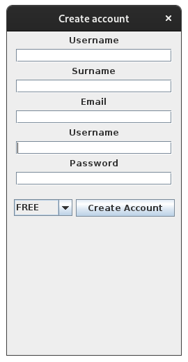

# Design choices

- Model View Controller
- Repository Pattern
- Dependency Injection (Not implemented in Java but it's ready)
- REST API for user operations
- The Movie Database for mock videos

# Usage

You can use <https://61bd22fcd8542f0017824b39.mockapi.io/api/v1/:endpoint> for read.

But to update and delete you need use local json-server you can run with `npx json-server --watch ./json-server/db.json`. You need to `npm install` before.

# Problems

## Swing level details bas

- Usage of multiple `JFrame`
- Probably lots of reinvent of wheel
- Poor layout managers
- Sometimes no layout managers!
- Didn't respect to swings thread system

##

- Image download is not on separate thread it blocks UI
- Actually everything can block UI because I haven't separated it

## Lots of boilerplate but no DI

## Used lots of C# conventions

## Very ugly design

# Screenshots

    

